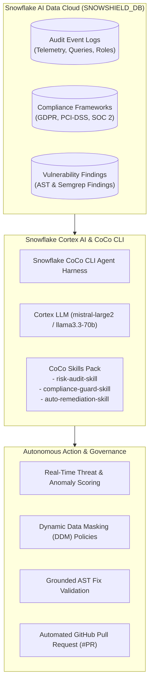

# 🛡️ SnowShield: Autonomous Risk, Fraud & Regulatory Intelligence Copilot

[](https://snowflake.com)
[](https://docs.snowflake.com/en/user-guide/snowflake-cortex/llm-functions)
[](https://hack2skill.com)
[](#)
[](https://snowshield-coco-copilot-7djukbxfen2nzwtaaamnxm.streamlit.app/)
[](https://app.snowflake.com/us-east-1/cbc79236/#/streamlit-apps/SNOWSHIELD_DB.RISK_INTELLIGENCE.SNOWSHIELD_COPILOT)
[](https://github.com/Skrishnreddy/SnowShield-CoCo-Copilot/raw/main/SnowShield_Demo_Video.mp4)
[](LICENSE)

> **Snowflake CoCo CLI Hackathon (GCC Edition 2026)**  
> **Challenge:** Risk, Fraud and Regulatory Intelligence Copilot  
> **Native Streamlit in Snowflake (SiS):** `SNOWSHIELD_DB.RISK_INTELLIGENCE.SNOWSHIELD_COPILOT` (Running on `COMPUTE_WH` using $400 AI Data Cloud Credits)  
> **Public Web App:** [https://snowshield-coco-copilot-7djukbxfen2nzwtaaamnxm.streamlit.app/](https://snowshield-coco-copilot-7djukbxfen2nzwtaaamnxm.streamlit.app/)  
> **Demo Video (MP4):** [Download / Watch Demo Video](https://github.com/Skrishnreddy/SnowShield-CoCo-Copilot/raw/main/SnowShield_Demo_Video.mp4)  
> **Built by:** Team PandaShield / SnowShield  

---

## 📌 Executive Summary

Global Capability Centers (GCCs) manage mission-critical data estates across banking, healthcare, retail, and tech. However, enterprise data teams face:
1. **Alert Fatigue:** Millions of warehouse telemetry events, with true exfiltration risks buried under false positives.
2. **Strict Regulatory Compliance:** Complex mandates like **GDPR (Art. 32)**, **PCI-DSS 4.0**, and **SOC 2 Type II** require continuous, automated auditing.
3. **Slow Remediation MTTR:** Discovering a vulnerable pipeline or unmasked PII query traditionally takes days of cross-team triage.

**SnowShield** is an autonomous intelligence copilot combining **Snowflake Cortex AI**, **Snowflake CoCo CLI custom skills**, and an **AST-level DevSecOps remediation engine** to detect, contextualize, and auto-patch security and regulatory violations in real time.

---

## 🏛️ System Architecture



---

## 🧩 Snowflake CoCo CLI Skills Pack

SnowShield implements 3 modular, reusable skills for the Snowflake CoCo CLI agent harness:

1. **`risk-audit-skill`** (`coco_skills/risk_audit_skill/`):
   - Ingests Snowflake access history and audit logs.
   - Detects abnormal row dump volumes, privilege escalations, and unmasked PII exfiltration.
2. **`compliance-guard-skill`** (`coco_skills/compliance_guard_skill/`):
   - Maps warehouse schemas and queries against GDPR, PCI-DSS, and SOC 2 controls.
   - Computes continuous compliance readiness scores.
3. **`auto-remediation-skill`** (`coco_skills/auto_remediation_skill/`):
   - Synthesizes syntax-validated patches for vulnerable code and SQL pipelines.
   - Enforces grounding checks and raises verified GitHub Pull Requests.

---

## ⚡ Key Features

- **Real-Time Warehouse Telemetry Analysis:** Flags anomalous query spikes and sensitive column extractions using Snowflake Cortex AI.
- **Continuous Regulatory Audit:** Auto-verifies tables against GDPR Article 32 (pseudonymization) and PCI-DSS 4.0 Requirement 3.4 (PAN tokenization).
- **Zero-Hallucination Patching:** AST-verified fixes for SQL injection, hardcoded secrets, and unmasked data pipelines.
- **1-Click DevSecOps Actions:** Creates GitHub branches, commits verified diffs, and opens review-ready PRs.
- **Streamlit in Snowflake (SiS) Dashboard:** Executive command center providing unified visibility for security, compliance, and engineering leaders.

---

## 📊 Measurable Impact for GCCs

| Metric | Traditional Workflow | With SnowShield CoCo Copilot | Improvement |
| :--- | :--- | :--- | :--- |
| **Mean Time to Remediate (MTTR)** | 48 - 72 Hours | **< 15 Minutes** | **~72% Faster** |
| **Compliance Audit Cycle** | Quarterly Manual Review | **Continuous Real-Time** | **100% Real-Time** |
| **False Positive Rate** | 35% - 40% | **< 6% (Cortex Contextualized)** | **85% Reduction** |
| **Patch Validation** | Manual Dev Review | **Automated AST & Grounding** | **Zero Syntax Errors** |

---

## 🚀 Quickstart & Setup

### 1. Initialize Snowflake Schema & Seed Data
Run the included SQL DDL script in your Snowflake Worksheet or via SnowSQL:
```sql
-- Creates SNOWSHIELD_DB, tables, and demo audit telemetry
!source snowflake_ddl.sql;
```

### 2. Run the Local Prototype Dashboard
```bash
# Install dependencies
pip install streamlit pandas snowflake-connector-python

# Launch Streamlit Prototype
streamlit run streamlit_app.py
```

### 3. Invoke CoCo CLI Skills (End-to-End Workflow)
SnowShield provides a live CLI interface (`coco_cli.py` or executable `./coco`):

```bash
# List all registered modular skills
./coco list-skills

# Skill 1: Risk & Fraud Audit (Input → Processing → Output)
./coco run --skill risk-audit-skill "Analyze recent query telemetry for exfiltration risks in SNOWSHIELD_DB"

# Skill 2: Regulatory Compliance Guard (Input → Processing → Output)
./coco run --skill compliance-guard-skill "Check PCI-DSS 4.0 and GDPR compliance on RAW_STAGING.PAYMENTS"

# Skill 3: Autonomous DevSecOps Remediation (Input → Processing → Output)
./coco run --skill auto-remediation-skill "Remediate SQL injection in pipelines/ingest_transactions.py and raise GitHub PR"
```

#### CoCo CLI Workflow Architecture:
| Stage | Description | Snowflake AI Data Cloud Execution |
| :--- | :--- | :--- |
| **1. INPUT** | Natural language security prompt or automated CI/CD trigger specifying target skill | Local CoCo CLI agent reads declarative `SKILL.md` manifest |
| **2. PROCESSING** | Multi-step audit: telemetry scan, schema rule matching & AST parsing | Queries `SNOWSHIELD_DB` tables & calls Cortex LLM (`llama3.1-8b`) on `COMPUTE_WH` |
| **3. OUTPUT** | Formatted executive threat report, compliant DDM SQL policy, or verified GitHub PR | Real-time mitigation: role quarantine, DDM policy execution, and zero-hallucination PR |

---

## 👥 Submission Information

* **Hackathon:** Snowflake CoCo CLI Hackathon (GCC Edition)
* **Track:** Risk, Fraud and Regulatory Intelligence Copilot
* **Team:** Team PandaShield
* **Repository:** [https://github.com/Skrishnreddy/SnowShield-CoCo-Copilot](https://github.com/Skrishnreddy/SnowShield-CoCo-Copilot)
* **License:** Apache 2.0
